# Turizm Dijitalleşme Projesi


[](LICENSE)

Turizm Dijitalleşme Projesi, bir turizm acentesinin işlerini hem kullanıcı hem de yönetici tarafında dijitalleştirmek amacıyla geliştirilmiş iki entegre uygulamadan oluşmaktadır.

* **Kullanıcı Uygulaması** → Paket turları listeleme, detaylarını inceleme, kampanya ve reklamları görüntüleme.
* **Admin Uygulaması** → Turlar, kampanyalar, rezervasyonlar, müşteri bilgileri ve finans süreçlerinin yönetilmesi.

---

## 🌟 Özellikler

### Kullanıcı Uygulaması

* 🏖️ **Tur Paketleri**: Kategorilere göre tur listeleme ve detay görüntüleme
* 📢 **Kampanyalar ve Reklamlar**: Acentenin güncel kampanyalarını ve kendi tasarladığı reklamlarını görüntüleme
* ☎️ **Hızlı İletişim**: Floating Action Button ile doğrudan arama

### Admin Uygulaması

* 📊 **Finans Yönetimi**: Tur maliyetleri, raporlar ve gider hesaplamaları
* 👥 **Müşteri Yönetimi**: Müşteri kayıtları, rezervasyon takibi, borcu olan müşteriler listesi
* 🏨 **Otel Yönetimi**: Oda yerleşimi ve otel detayları
* 🚌 **Ulaşım Yönetimi**: Otobüs yerleşim planı
* 🎯 **Kampanya ve Reklam Yönetimi**: Yeni kampanya/reklam ekleme, güncelleme ve listeleme

---

## 🚧 Planlanan Özellikler

* Çoklu dil desteği
* Gerçek zamanlı bildirimler (Firebase Cloud Messaging)
* Daha gelişmiş raporlama modülleri

---

## 🧰 Teknik Altyapı

* **Framework**: Flutter (Cross-platform)
* **Dil**: Dart
* **Backend & Database**: Firebase (Authentication, Firestore, Storage)
* **Mimari**: MVVM (Model-View-ViewModel)
* **Durum Yönetimi**: Provider

---

## 📸 Ekran Görüntüleri

<table>
  <tr>
    <td>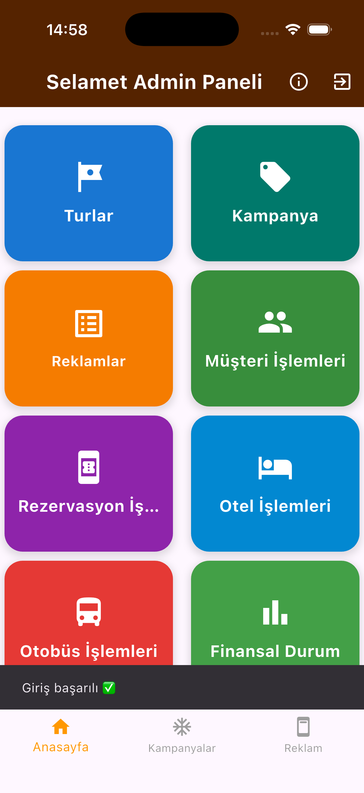</td>
    <td>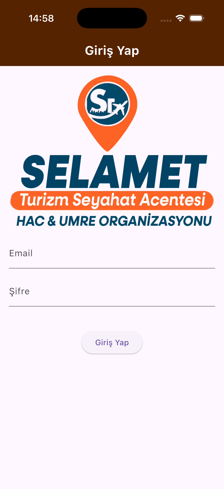</td>
    <td>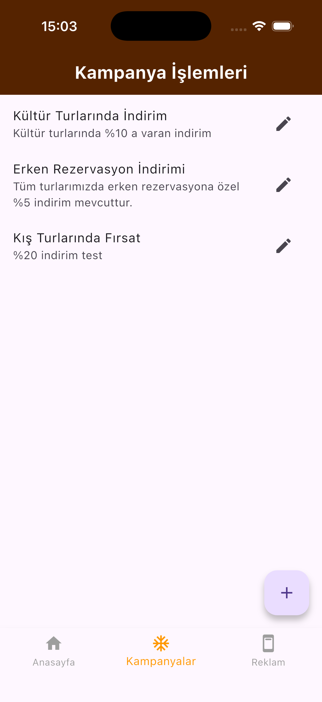</td>
    <td>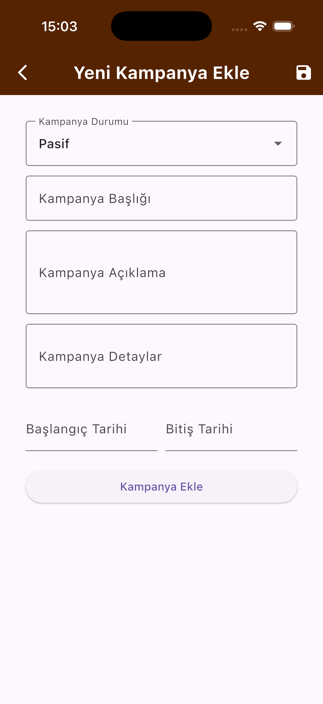</td>
    <td>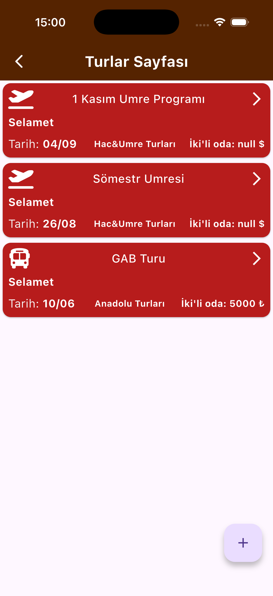</td>
    <td></td>
    <td>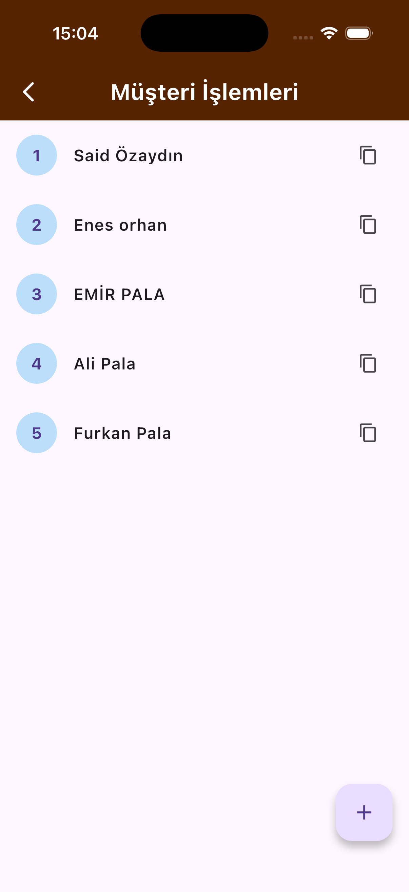</td>
    <td>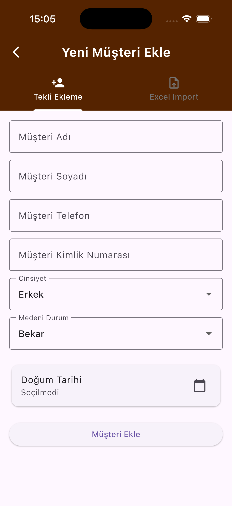</td>
    <td>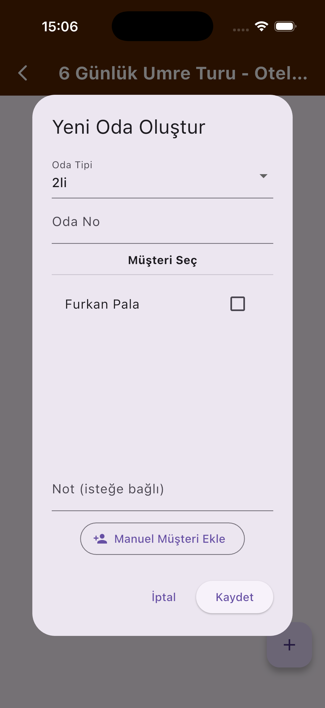</td>
    <td>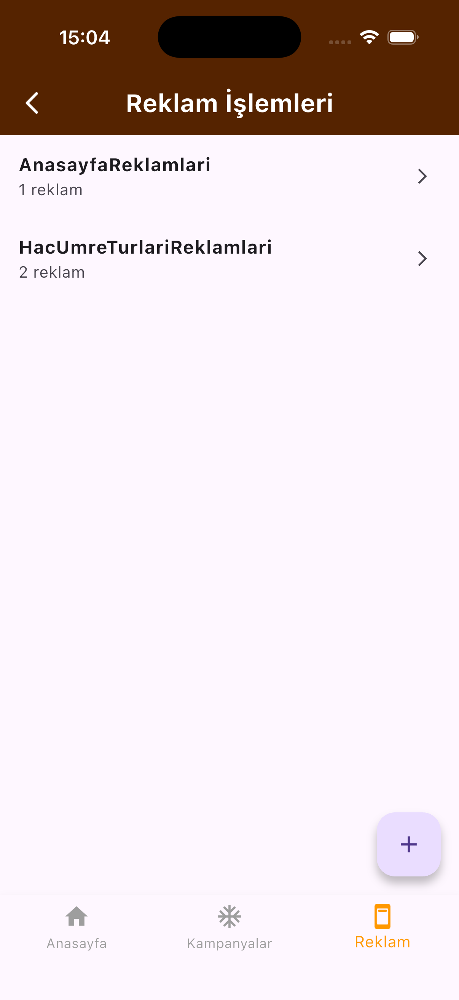</td>
    <td>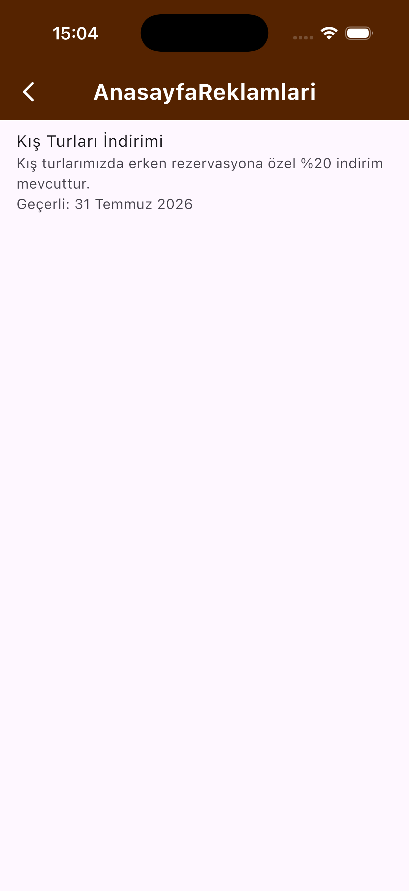</td>
    <td>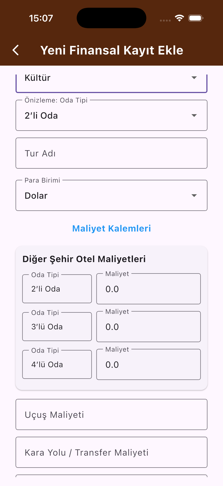</td>
    <td>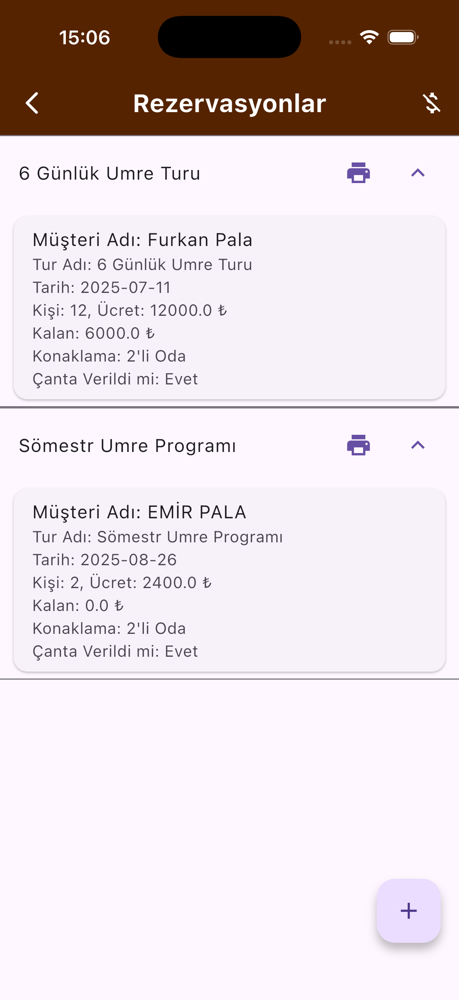</td>
    <td>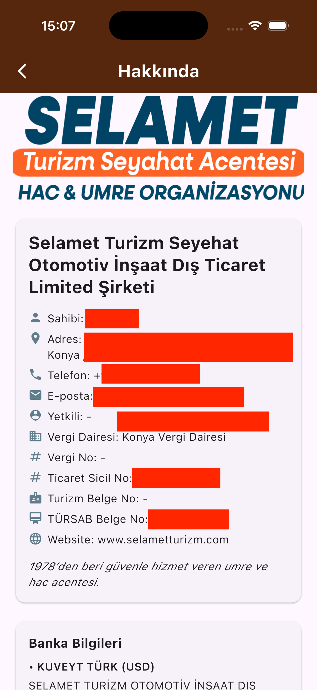</td>

  </tr>
</table>

---

## 📂 Proje Yapısı (Örnek)

```plaintext
lib/
├── Navbars/
│   ├── bottom_navbar_widget.dart
│   └── home_page.dart
│
├── Core/
│   ├── constants/
│   │   ├── app_colors.dart
│   │   ├── app_icons.dart
│   │   └── app_strings.dart
│
├── Pages/
│   ├── Auth/          # Kullanıcı giriş/kayıt
│   ├── Finans/        # Finansal işlemler
│   ├── Hakkinda/      # Şirket bilgileri
│   ├── Kampanyalar/   # Kampanya yönetimi
│   ├── Musteriler/    # Müşteri yönetimi
│   ├── Otel/          # Otel işlemleri
│   ├── Reklamlar/     # Reklam yönetimi
│   ├── Rezervasyonlar # Rezervasyon işlemleri
│   ├── Turlarlar/     # Tur paketleri
│   └── Widgets/       # Ortak bileşenler
```

---

## 🚀 Kurulum ve Çalıştırma

### Gereksinimler

* Flutter SDK (3.0 veya üstü)
* Dart SDK (2.17 veya üstü)
* Firebase hesabı ve gerekli konfigürasyon dosyaları (`google-services.json` / `GoogleService-Info.plist`)

### Çalıştırma Adımları

1. **Depoyu klonlayın**

   ```bash
   git clone https://github.com/wetadeveloper/turizm_acente_admin.git
   cd turizm_acente_admin
   ```

2. **Bağımlılıkları yükleyin**

   ```bash
   flutter pub get
   ```

3. **Firebase konfigürasyonunu ekleyin**

   * Android → `android/app/google-services.json`
   * iOS → `ios/Runner/GoogleService-Info.plist`

4. **Uygulamayı çalıştırın**

   ```bash
   flutter run
   ```

---

## 📊 Yol Haritası

| Özellik                        | Durum                   |
| ------------------------------ | ----------------------- |
| Kullanıcı tarafı tur listeleme | ✅ Tamamlandı            |
| Kampanyalar & Reklamlar        | ✅ Tamamlandı            |
| Rezervasyon yönetimi           | ✅ Tamamlandı            |
| Finans modülü                  | ✅ Tamamlandı            |
| Bildirim sistemi               | ⏳ Geliştirme aşamasında |
| Çoklu dil desteği              | ⏳ Planlandı             |

---

## 📄 Lisans

Bu proje MIT lisansı ile dağıtılmaktadır. Daha fazla bilgi için `LICENSE` dosyasına göz atın.

---

## 📬 İletişim

**Furkan Pala** – Flutter Developer
[](https://www.linkedin.com/in/furkan-pala-9086191b0/)
[](https://github.com/wetadeveloper)